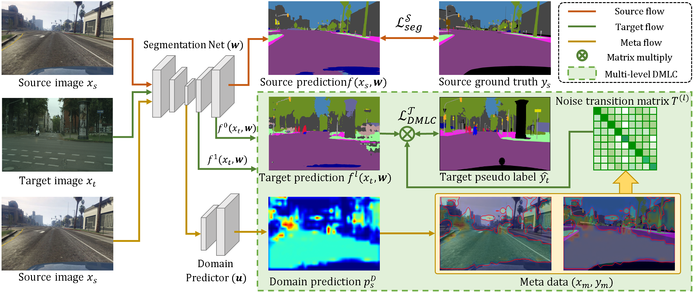

# MetaCorrection: Domain-aware Meta Loss Correction for Unsupervised Domain Adaptation in Semantic Segmentation

This is the Pytorch implementation of our [MetaCorrection](https://arxiv.org/pdf/2103.05254.pdf) paper published in CVPR 2021.

## Introduction
### Abstract
Unsupervised domain adaptation (UDA) aims to transfer the knowledge from the labeled source domain to the unlabeled target domain. Existing self-training based UDA approaches assign pseudo labels for target data and treat them as ground truth labels to fully leverage unlabeled target data for model adaptation. However, the generated pseudo labels from the model optimized on the source domain inevitably contain noise due to the domain gap. To tackle this issue, we advance a MetaCorrection framework, where a Domain-aware Meta-learning strategy is devised to benefit Loss Correction (DMLC) for UDA semantic segmentation. In particular, we model the noise distribution of pseudo labels in target domain by introducing a noise transition matrix (NTM) and construct meta data set with domain-invariant source data to guide the estimation of NTM. Through the risk minimization on the meta data set, the optimized NTM thus can correct the noisy issues in pseudo labels and enhance the generalization ability of the model on the target data. Considering the capacity gap between shallow and deep features, we further employ the proposed DMLC strategy to provide matched and compatible supervision signals for different level features, thereby ensuring deep adaptation. Extensive experimental results highlight the effectiveness of our method against existing state-of-the-art methods on three benchmarks.

### Metacorrection overview


## Installation
Install dependencies:
```
pip install -r requirements.txt
```


## Dataset
* Download the [GTA5 Dataset](https://download.visinf.tu-darmstadt.de/data/from_games/) as the source domain, and put it in the data/GTA5 folder
* Download the [Cityscapes Dataset](https://www.cityscapes-dataset.com/) as the target domain, and put it in the data/Cityscapes folder

## Usage
### Train
Step 1: train a domain predictor and generate meta data
```
python train_adv.py
```

Step 2: train the metacorrection framework
```
python train_meta.py
```

### Test
evaluate the metacorrection network with [pretrained model](https://drive.google.com/file/d/1py9jdlpmpdQWErSX6lEGaR_DvOUvIPoA/view?usp=sharing)
```
python evaluate.py
```


## Acknowledgment
This code is heavily borrowed from [AdaptSegNet](https://github.com/wasidennis/AdaptSegNet)

## Citation
If you find our work useful in your research or publication, please cite our work:
```
@article{guo2021metacorrection,
  title={MetaCorrection: Domain-aware Meta Loss Correction for Unsupervised Domain Adaptation in Semantic Segmentation},
  author={Guo, Xiaoqing and Yang, Chen and Li, Baopu and Yuan, Yixuan},
  booktitle = {IEEE Conference on Computer Vision and Pattern Recognition (CVPR)},
  year={2021}
}
```

